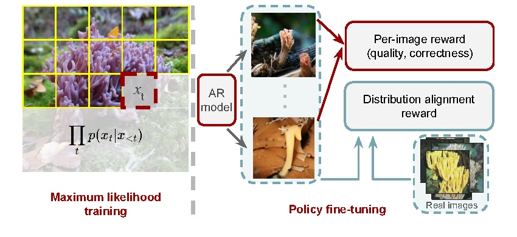

# Policy-based Tuning of Autoregressive Image Models

Official implementation of **Policy-based Tuning of Autoregressive Image Models with Instance- and Distribution-Level Rewards** (ECCV 2026).

[[Paper](https://arxiv.org/abs/2603.23086)] [[LlamaGen backbone](https://github.com/FoundationVision/LlamaGen)]




This repository tunes a pretrained class-conditional autoregressive image model with a GRPO-style objective. The implementation combines instance-level CLIP and HPSv2 rewards with an online distribution-level diagonal-FID reward. It covers policy tuning and image generation.

## Setup

The code was tested with Python 3.10, PyTorch 2.5.1, torchvision 0.20.1, and CUDA 11.8. A recent NVIDIA GPU is recommended.

### Conda

```bash
git clone https://github.com/bugrabaran/ar-policy-tuning.git
cd ar-policy-tuning
conda env create -f environment.yml
conda activate ar-policy-tuning
```

No container is required. If the pinned CUDA build is unsuitable for your machine, create a Python 3.10 environment, install a compatible PyTorch/torchvision build from the [official PyTorch instructions](https://pytorch.org/get-started/locally/), and then run:

```bash
python -m pip install -r requirements.txt
```

CLIP, HPSv2, and Inception weights are downloaded to the local cache on first use. Set `HF_HOME` if you want that cache elsewhere.

## Pretrained weights and statistics

Download the public LlamaGen GPT-L and VQ checkpoints:

```bash
mkdir -p pretrained_models
curl -L https://huggingface.co/FoundationVision/LlamaGen/resolve/main/c2i_L_256.pt \
  -o pretrained_models/c2i_L_256.pt
curl -L https://huggingface.co/FoundationVision/LlamaGen/resolve/main/vq_ds16_c2i.pt \
  -o pretrained_models/vq_ds16_c2i.pt
```

The distribution-level reward additionally expects these files, which are provided with the [GitHub release assets](https://github.com/bugrabaran/ar-policy-tuning/releases):

| File | SHA-256 |
|---|---|
| `imagenet_train_incv3_299_original.npz` | `d008aeaca37e5740242ab704b23991e5e0300a93b1e8e6dd2cf0c6574e702c4e` |
| `pretrained_gen_stats.npz` | `2cc90bcee3573fe317f2c79f67585416b0ad9e39aa65a3aadf69c167548a1a81` |

Place them in the repository root, or set `FID_STATS_NPZ` and `FID_INIT_GEN_NPZ` to their locations. They are not needed when `W_FID=0`. The tuned model checkpoint is intentionally omitted from the initial code release; policy tuning starts from the public LlamaGen checkpoint above.

The expected default layout is:

```text
ar-policy-tuning/
├── pretrained_models/
│   ├── c2i_L_256.pt
│   └── vq_ds16_c2i.pt
├── imagenet_train_incv3_299_original.npz
└── pretrained_gen_stats.npz
```

## Generate images from the base model

```bash
python sample_per_class_or_name.py \
  --gpt-ckpt pretrained_models/c2i_L_256.pt \
  --vq-ckpt pretrained_models/vq_ds16_c2i.pt \
  --class-names "golden retriever, tabby" \
  --per-class 4 \
  --batch-size 4 \
  --sample-dir samples
```

Classes can instead be selected with comma-separated `--class-ids` or a `--class-list-file` containing one ImageNet class name per line.

## Train

`train.sh` uses `torchrun` through PyTorch's distributed launcher. Its defaults reproduce the main optimization settings (`G=12`, `K=2`, all three rewards, and 600 iterations), while environment variables make the same command usable on different hardware.

First export non-default artifact locations if needed:

```bash
export GPT_CKPT=/path/to/c2i_L_256.pt
export VQ_CKPT=/path/to/vq_ds16_c2i.pt
export FID_STATS_NPZ=/path/to/imagenet_train_incv3_299_original.npz
export FID_INIT_GEN_NPZ=/path/to/pretrained_gen_stats.npz
```

### Single GPU

Use smaller per-device values when memory is limited:

```bash
NPROC_PER_NODE=1 \
PER_PROC_BATCH_SIZE=1 \
NUM_GENERATIONS=2 \
bash train.sh
```

### Multiple GPUs on one node

For eight GPUs with the default training settings:

```bash
NPROC_PER_NODE=8 bash train.sh
```

`PER_PROC_BATCH_SIZE` is the number of prompts handled by each process, and `NUM_GENERATIONS` is the number of completions per prompt. Reduce either value if the run exceeds GPU memory.

### Multiple nodes

Run the same command on every node with a shared address and a distinct rank:

```bash
# Node 0
NNODES=2 NODE_RANK=0 NPROC_PER_NODE=8 \
MASTER_ADDR=10.0.0.1 MASTER_PORT=29500 bash train.sh

# Node 1
NNODES=2 NODE_RANK=1 NPROC_PER_NODE=8 \
MASTER_ADDR=10.0.0.1 MASTER_PORT=29500 bash train.sh
```

For Slurm, activate the environment and submit the included scheduler wrapper. Adjust only the resource headers for your cluster:

```bash
sbatch grpo.slurm
```

Training outputs are written to `grpo_runs/run1` by default. Set `OUT_DIR` to use another directory. The launcher passes that directory to `--resume`, so a `checkpoint-last.pth` found there is resumed automatically. Any extra command-line arguments supplied after `train.sh` are forwarded to `grpo.py`.

Once a checkpoint has been saved, generate images from the tuned policy by passing it to the same sampling script:

```bash
python sample_per_class_or_name.py \
  --gpt-ckpt grpo_runs/run1/checkpoint-last.pth \
  --vq-ckpt pretrained_models/vq_ds16_c2i.pt \
  --class-names "golden retriever, tabby" \
  --per-class 4 \
  --sample-dir tuned_samples
```

Common overrides include:

| Variable | Default | Meaning |
|---|---:|---|
| `NPROC_PER_NODE` | `1` | GPUs/processes per node |
| `PER_PROC_BATCH_SIZE` | `12` | Prompts per process |
| `NUM_GENERATIONS` | `12` | Samples per prompt (`G`) |
| `INNER_EPOCHS` | `2` | Policy updates per sampled batch (`K`) |
| `MAX_ITERATIONS` | `600` | Training iterations |
| `W_CLIP`, `W_HPS`, `W_FID` | `1.0` | Reward weights |
| `OUT_DIR` | `grpo_runs/run1` | Checkpoints and logs |

The entropy-controller settings can likewise be overridden with `ENT_COEF_BASE`, `ENT_MIN`, `ENT_MAX`, `ENT_TARGET_FRAC`, `ENT_DEADBAND`, `ENT_K`, `WARMUP_FRAC`, and `DECAY_START_FRAC`.

## Citation

```bibtex
@inproceedings{baran2026policy,
  title   = {Policy-based Tuning of Autoregressive Image Models with Instance- and Distribution-Level Rewards},
  author  = {Baran, Orhun Bugra and Kandemir, Melih and Cinbis, Ramazan Gokberk},
  booktitle = {European Conference on Computer Vision (ECCV)},
  year    = {2026}
}
```

## Acknowledgements

This codebase builds on [LlamaGen](https://github.com/FoundationVision/LlamaGen). We thank its authors for releasing the pretrained models and implementation.

## License

See [LICENSE](LICENSE).
